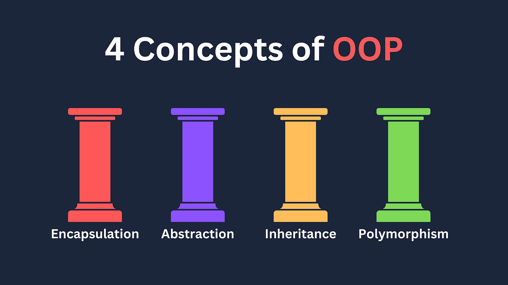

# Object Oriented Programming (OOP)
it aims to implement real-world entities into the code

# The four pillars in OOP


# Encapsulation
- In real life, we don't want the finance section and technology section able to access each section's data
- So, we need to encapsulate each section data to prevent accession from other sections.

```C++
#include <iostream>
#include <string>

using namespace std;

class technology{
    private:
        int budget = 0;
        int spending = 0;
        string projectName;

        void spend_money(int n){
            spending += n;
            budget -= n;
            cout << "total spending :" << spending << endl;
        }

    public:
        void get_projectName(){
            cout << projectName << endl;
        }
        void set_name(const string& name){
            projectName = name;
        }
        void set_budget(int n){
            budget = n;
        }
        
        void get_money_left(){
            cout << "Money left :" << budget << endl;
        }
};
```


```C++
int main(int argc, char* argv[]){
    technology t1;
    cout << t1.projectName << endl;
    return 0;
}
```
Output ERROR
```
test.cpp: In function ‘int main(int, char**)’:
test.cpp:44:16: error: ‘std::string technology::projectName’ is private within this context
   44 |     cout << t1.projectName << endl;
      |                ^~~~~~~~~~~
test.cpp:22:16: note: declared private here
   22 |         string projectName;
      |                ^~~~~~~~~~~
```
# NOTE array and pointer to the class
- We can also create pointer, which points to the class
- We also can create a array of class to store multiple class objects.

# Abstraction
- hiding the messy details and showing only what you need to use as the user.
``` C++
class technology{
    private:
        int budget;
        int spending = 0;
        string projectName;
    public:
        void get_projectName(){
            cout << projectName << endl;
        }
        void set_name(const string& name){
            projectName = name;
        }
        void set_budget(int n){
            budget = n;
        }
        void spend_money(int n){
            spending += n;
            budget -= n;
            cout << "total spending :" << spending << endl;
        }
        void get_money_left(){
            cout << "Money left : " << budget << endl;
        }

        void do_research(){
            // Doing something....
            // very complex logic
            spend_money(100);
            spend_money(200);
            spend_money(300);
        }
};
```
```C++
int main(int argc, char* argv[]){
    technology t1;
    t1.set_name("NEW AI");
    t1.set_budget(100);

    t1.get_projectName();
    t1.do_research();
    t1.get_money_left();
    
    return 0;
}
```
Output
```
NEW AI
total spending :100
total spending :300
total spending :600
Money left :-500
```
# Inheritance

- It is the mechanism by which one class is allowed to inherit the features (fields and methods) of another class.
```C++
class department{
    private:
        string departmentName;
    public:
        void get_departmentName(){
            cout << departmentName << endl;
        }
        void set_departmentName(const string &s){
            departmentName = s;
        }
};

//Inheritance happened here
class technology: public department{
    private:
        int budget;
        int spending = 0;
        string projectName;
    public:
        void get_projectName(){
            cout << projectName << endl;
        }
        void set_name(const string& name){
            projectName = name;
        }
        void set_budget(int n){
            budget = n;
        }
        void spend_money(int n){
            spending += n;
            budget -= n;
            cout << "total spending :" << spending << endl;
        }
        void get_money_left(){
            cout << "Money left : " << budget << endl;
        }

        void do_research(){
            // Doing something....
            // very complex logic
            spend_money(100);
            spend_money(200);
            spend_money(300);
        }
};
int main(int argc, char* argv[]){
    technology t1;
    t1.set_departmentName("Technology divison");
    t1.get_departmentName();
    return 0;
}
```

# Polymorphism
- Polymorphism is the ability of any data to be processed in more than one form.
